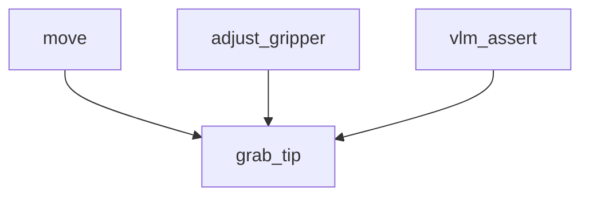

# Robot Skill Hierarchy System

This system provides multiple ways to visualize and understand how robot skills are composed hierarchically.

## Files Overview

### Core Files
- **`skill_compositions.json`** - Defines how T1 and T2 skills are composed of lower-tier skills
- **`skill_hierarchy_visualizer.py`** - Python script to generate text and Mermaid diagrams
- **`skill_hierarchy.html`** - Interactive web-based visualizer

## Hierarchy Structure

### Tier 0 (Atomic Skills)
- **Cannot be decomposed further**
- Basic robot movements, vision, and safety operations
- Examples: `move`, `grab_object`, `adjust_gripper`, `vlm_assert`, `pose_estimation`

### Tier 1 (Reusable Patterns)
- **Composed of T0 skills**
- Reusable robotic patterns for common tasks
- Examples: `grab_tip`, `aspirate`, `dispense`, `mix`, `scan_workspace`

### Tier 2 (Procedural Skills)
- **Composed of T1 and T0 skills**
- High-level workflows and procedures
- Examples: `load_machine`, `transfer_liquid`, `plate_processing`, `quality_control`

## Usage Examples

### 1. Python Visualizer
```bash
# Run the Python visualizer
python skill_hierarchy_visualizer.py

# Or with custom compositions file
python skill_hierarchy_visualizer.py my_compositions.json
```

### 2. Web Visualizer
Open `skill_hierarchy.html` in a web browser for an interactive experience.

### 3. Mermaid Diagrams
The Python script generates Mermaid diagrams that can be used in documentation:


## Skill Composition Format

Each skill composition includes:
- **Description**: What the skill does
- **Composed of**: List of sub-skills with parameters
- **Order**: Execution sequence
- **Repeat**: Optional repetition conditions

### Example: `grab_tip` Composition
```json
{
  "grab_tip": {
    "description": "Pick up a new pipette tip from tip rack",
    "composed_of": [
    {
      "skill": "move",
      "parameters": {
        "translations": "to_tip_rack_position",
        "rotations": "approach_angle"
      },
      "order": 1
    },
    {
      "skill": "adjust_gripper",
      "parameters": {
        "action": "close",
        "force": "grasp_force"
      },
      "order": 2
    },
    {
      "skill": "vlm_assert",
      "parameters": {
        "assertion": "tip_attached",
        "object_id": "pipette_tip"
      },
      "order": 3
    }
  ]
}
```

## Benefits

### 1. **Transparency**
- See exactly what actions are executed for each skill
- Understand the complexity and dependencies

### 2. **Debugging**
- Trace execution paths when skills fail
- Identify which atomic actions need attention

### 3. **Optimization**
- Find common sub-patterns that can be optimized
- Identify redundant operations

### 4. **Documentation**
- Clear understanding of skill relationships
- Easy onboarding for new developers

### 5. **Validation**
- Ensure all required sub-skills are available
- Verify parameter compatibility

## Execution Flow Example

When executing `transfer_liquid`:
1. **grab_tip** → `move` + `adjust_gripper` + `vlm_assert`
2. **aspirate** → `move` + `pose_estimation` + `move` + `vlm_assert`
3. **dispense** → `move` + `pose_estimation` + `move` + `vlm_assert`
4. **discard_tip** → `move` + `adjust_gripper` + `vlm_assert`

**Total**: 12 atomic operations for one T2 skill!

## Adding New Skills

To add a new skill to the hierarchy:

1. **Define the skill** in the appropriate tier section
2. **List all sub-skills** it's composed of
3. **Specify execution order** and parameters
4. **Update visualizers** if needed

## Future Enhancements

- **Execution time estimation** based on sub-skill durations
- **Resource usage tracking** (energy, materials, etc.)
- **Parallel execution** identification
- **Skill dependency graphs**
- **Performance optimization** suggestions
